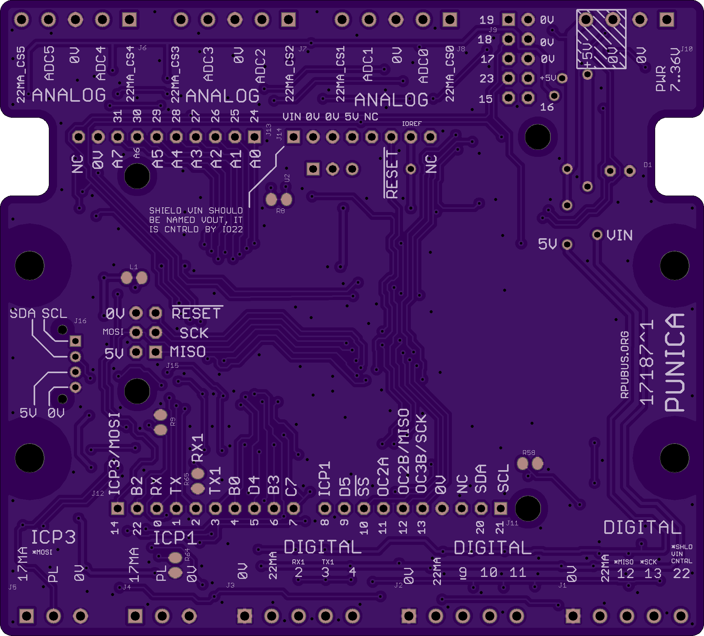

# Hardware

## Overview

This board has an ATmega1284p. It has two Input Capture (ICP1, ICP3) hardware units which each connect to an inverting open collector transistor that will pull down the respective ICP pin when current (e.g. >7mA) is flowing through a 100 Ohm sense resistor. The captured value is accurate to within one crystal (30ppm + drift) count of the pulse edge that caused the event. This captured value may, for example, be an acquisition of a rotating turbine. The board also has four groups of three level shifted l interfaces to the microcontroller input/output pins. Each of the four digital groups has a 22mA current source. There are six analog inputs with controlled current sources. The ATmega1284p can be programmed with the AVR toolchain on Debian, Ubuntu, Raspbian, and others.

Bootloader options include [optiboot] and [xboot]. Uploading through a bootloader eliminates fuse setting errors and there are few settings that can block an upload accidentally (e.g. some bootloaders can get stuck in a watchdog loop). 

[optiboot]: https://github.com/Optiboot/optiboot
[xboot]: https://github.com/alexforencich/xboot

## Inputs/Outputs/Functions

```
        ATmega1284p microcontroller.
        Twelve pluggable digital input/output (DIO 2,3,4,5,6,7,9,10,11,12,13,22) with level conversion.
        Four groups of Digital interfaces each with a 22 mA current source.
        Two Input Capture (ICP1, ICP3) with current sources for CAT5 pair current loops.
        Six Analog channels ADC0, ADC1, ADC2, ADC3, ADC4, ADC5.
        Six 22mA current source CS0, CS1, CS2, CS3, CS4, CS5 for analog loops.
        Six currrent sources are enabled with digital control DIO 15..19, and 23.
        Shunt limited diode test circuit with current on ADC7 and voltage on ADC6.
        MCU power (+5V) is from an SMPS.
```

## Uses

```
        Microcontroller based test control system.
        Has hardware for diode testing somewhat like found on DMM's.
        ICT, e.g. use with a relay matrix to scan the diode test on the test points befor power up.
```

## Notice

```
        AREF from ATmega1284p is not connected to the header.
        3V3 is not present on the board, the header pin is not connected.
```


# Table Of Contents

1. [Status](#status)
2. [Design](#design)
3. [Bill of Materials](#bill-of-materials)
4. [Assembly](#assembly)
5. [How To Use](#how-to-use)


# Status


```
        ^0  Done: 
            WIP: Design,
            Todo: Layout, BOM, Review*, Order Boards, Assembly, Testing, Evaluation.
            *during review the Design may change without changing the revision.
```

Debugging and fixing problems i.e. [Schooling](./Schooling/)

Setup and methods used for [Evaluation](./Evaluation/)


# Design

The board is 0.063 thick, FR4, two layer, 1 oz copper with ENIG (gold) finish.





## Electrical Parameters (Typical)

```
TBD
```

## Mounting

```
DIN rail
```

## Electrical Schematic


## Testing

Check correct assembly and function with [Testing](./Testing/)


# Bill of Materials

Import the [BOM](./Design/17187,BOM.csv) into LibreOffice Calc (or Excel), or use a text editor.


# Assembly

## SMD

The board is assembled with CHIPQUIK no-clean solder SMD291AX (RoHS non-compliant). 

The SMD reflow is done in a Black & Decker Model NO. TO1303SB which has the heating elements controlled by a Solid State Relay and an ATMega328p loaded with this [Reflow] firmware.

[Reflow]: ../Reflow


# How To Use


TBD