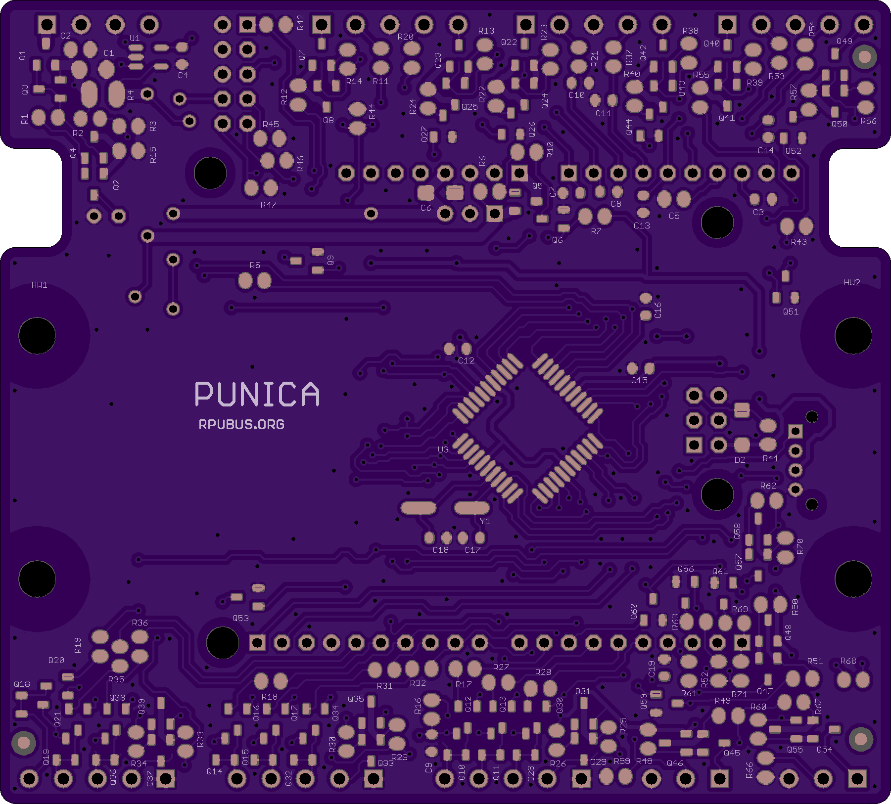
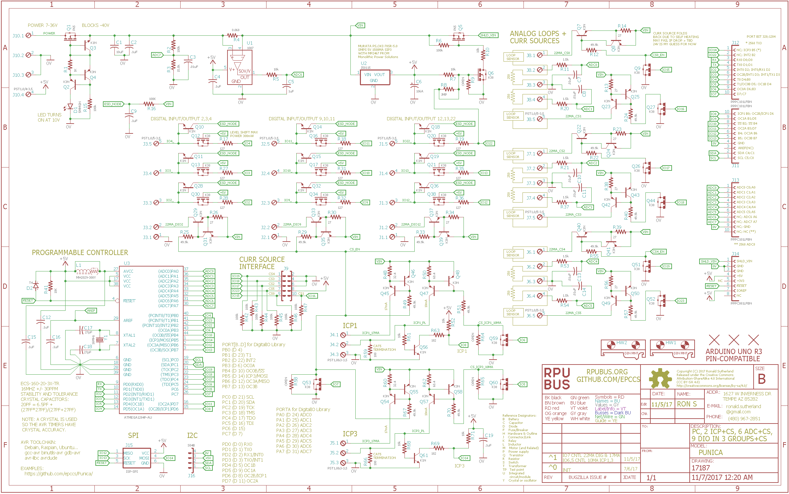

# Hardware

## Overview

This board has an ATmega1284p. It has two Input Capture (ICP1, ICP3) hardware units which each connect to an inverting open collector transistor that will pull down the respective ICP pin when current (e.g. >7mA) is flowing through a 100 Ohm loop termination resistor. The captured value is accurate to within one crystal (30ppm + drift) count of the pulse edge that caused the event. This captured value may, for example, be an acquisition of a rotating turbine. The board also has nine level shifted digital connections to the microcontroller input/output pins. The digital lines are grouped into three connectors that each have a 22mA current source. There are six analog inputs with controlled current sources for a sensor loop. The ATmega1284p can be programmed with the AVR toolchain on Debian, Ubuntu, Raspbian, and others.

Bootloader options include [optiboot] and [xboot]. Serial bootloaders can't change the hardware fuse setting which reduces programming errors that can accidentally brick the controller. 

[optiboot]: https://github.com/Optiboot/optiboot
[xboot]: https://github.com/alexforencich/xboot

## Inputs/Outputs/Functions

```
        ATmega1284p programs are compiled with open source tools that run nearly everywhere.
        Input power can range from 7 to 36V DC
        High side current sense on input power connected to ADC6.
        Input power voltage is divided down and connected to ADC7.
        Nine digital input/output (DIO 2,3,4,9,10,11,12,13,22) with level conversion.
        Digital IO is grouped in three pluggable interfaces each with a 22 mA current source and ground.
        Digital 22mA current sources enabled with DIO 7.
        Two Input Capture (ICP1, ICP3) with current sources for sensor loops.
        ICP1 and ICP3 17mA current source enabled with DIO 7.
        ICP1 10mA current source enabled with digital control DIO 6.
        ICP3 10mA current source enabled with digital control DIO 5.
        Six Analog channels ADC0, ADC1, ADC2, ADC3, ADC4, ADC5 with current sources for sensor loops.
        ADC0 22mA current source enabled with DIO 15.
        ADC1 22mA current source enabled with DIO 16.
        ADC2 22mA current source enabled with DIO 17.
        ADC3 22mA current source enabled with DIO 18.
        ADC4 22mA current source enabled with DIO 19.
        ADC5 22mA current source enabled with DIO 23. 
        MCU power (+5V) is converted with an SMPS from the input power.
        Up to an Amp can be safely used from the +5V.
```

## Uses

```
        Data Acquisition using Capture Hardware (ICP1, ICP3).
            Flow Meter(s)
            Rotating Hardware
            PWM Output Temperature Sensors
            PWM Output Capacitance Sensors
        Automation
            General purpose IO that is tolerant of the intrinsically reliable current source.
            The intrinsically reliable* current source will not harm the controller.
                * The intrinsically reliable current source can fail due to excessive power dissipation.
            String the intrinsically reliable current through multiple Solid State Relay to control multi-phase power.
            Power Off the shield VIN which powers a Raspberry Pi Zero on the RPUpi shield.
        Open Source Toolchain
            This is programmed with the GCC and an open toolchain.
            Note the Eagle board files are not available but I am looking at KiCAD.
```

## Notice

```
        AREF from ATmega1284p is not connected to the header.
        3V3 is not present on the board, the header pin is not connected.
```


# Table Of Contents

1. [Status](#status)
2. [Design](#design)
3. [Bill of Materials](#bill-of-materials)
4. [Assembly](#assembly)
5. [How To Use](#how-to-use)


# Status


```
        ^1  Done: Design, Layout, BOM,
            WIP: Review*,
            Todo: Order Boards, Assembly, Testing, Evaluation.
            *during review the Design may change without changing the revision.
            IO7 controls 3x22mA Digital and 2x17mA ICP
            IO6 controls 10mA ICP1
            IO5 controls 10mA ICP3

        ^0  Done: Design, Layout, BOM, Review*, Order Boards,
            WIP: not going to build this version
            Todo:  Assembly, Testing, Evaluation.
            *during review the Design may change without changing the revision.
```

Debugging and fixing problems i.e. [Schooling](./Schooling/)

Setup and methods used for [Evaluation](./Evaluation/)


# Design

The board is 0.063 thick, FR4, two layer, 1 oz copper with ENIG (gold) finish.




## Electrical Parameters (Typical)

```
TBD
```

## Mounting

```
DIN rail
```

## Electrical Schematic



## Testing

Check correct assembly and function with [Testing](./Testing/)


# Bill of Materials

The BOM is a CVS file(s), import it into a spreadsheet program like LibreOffice Calc (or Excel), or use a text editor.

Option | BOM's included
----- | ----- 
A. | [BRD] 
M. | [BRD] [SMD] [HDR] 
W. | [BRD] [SMD] [HDR] [PLUG]
Z. | [BRD] [SMD] [HDR] [PLUG] [DIN]

[BRD]: ./Design/17187BRD,BOM.csv
[SMD]: ./Design/17187SMD,BOM.csv
[HDR]: ./Design/17187HDR,BOM.csv
[PLUG]: ./Design/17187PLUG,BOM.csv
[DIN]: ./Design/17187DIN,BOM.csv


# Assembly

## SMD

The board is assembled with CHIPQUIK no-clean solder SMD291AX (RoHS non-compliant). 

The SMD reflow is done in a Black & Decker Model NO. TO1303SB which has the heating elements controlled by a Solid State Relay and an ATMega328p loaded with this [Reflow] firmware.

[Reflow]: ../Reflow


# How To Use


TBD