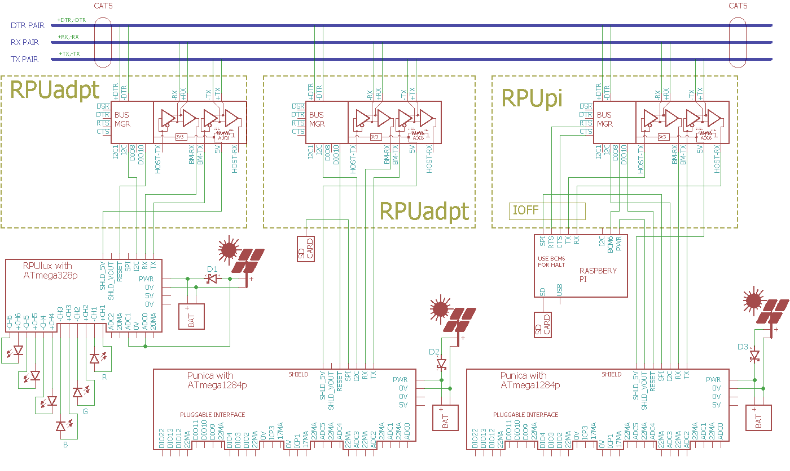

# Punica 

From <https://github.com/epccs/Punica/>

## Overview

This Controller board is based on an ATmega1284p which is programmable with the GCC toolchain (C or C++) for AVR found on [Debain], the toolchain is then ported to other distributions that run on various hardware. This board has pluggable connections for nine digital I/O in groups of three with a current source in each group, two Input Capture plugs, and three plugs each with two Analog inputs and a current source for sensor loops.

[Debain]: https://www.debian.org/

In some respects, this controller board is like a PLC but it does not have an interpreted language or ladder logic. The programs are compiled from source code (Assembler or C). The program instructions run in a single timing domain that is shared throughout the controller (for the most part) which ensures repeatable and simple event timing (typically to the clock edge). I do not think of the Punica board as a computer, I use a Raspberry Pi for the computing task, this board is more like a peripheral for the Raspberry Pi that can be programmed by the Pi and used to offload tasks that are suited for a programmable peripheral.

I use it with my [RPUpi], [RPUftdi], and [RPUadpt] shields. On the [RPUpi] I run a headless Raspberry Pi Zero with Raspian and the AVR toolchain installed, so I can build the Punica firmware directly from source, and upload the firmware to the bootloader and then interact with the running firmware using the Pi Zero hardware UART. In theory, the headless Pi Zero can be accessed by SSH from a local machine to edit the source, compile, and upload even when the internet gateway is down. Haha... yep my DSL is down as I am editing this (normal this time of year), online build tools and automation services are stupid, a push to GitHub can wait for the connection to be repaired. 

[RPUpi]: https://github.com/epccs/RPUpi
[RPUftdi]: https://github.com/epccs/RPUftdi
[RPUadpt]: https://github.com/epccs/RPUadpt

Punica is Latin for Pomegranate, I have found them to be reliable, productive, and tasty.


## Status


## [Hardware](./Hardware)

Hardware files include a schematic, bill of materials, and various notes for testing and evaluation. I think this is enough information to maintain the board should something go wrong.

## Example

This example shows an RS-422 serial bus that allows multiple microcontroller boards to be connected to a single computer serial port. It has an [RPUpi] shield that allows a Raspberry Pi Zero's hardware UART to connect as a host. The  Pi Zero has WiFi which I use for SSH connections and Samba file sharing. The other controller boards use an [RPUadpt] shield that daisy-chains the RS-422 with CAT5 cables. 



The level shifted DIO allows operation up to the supplied input voltage, so if it is powered with 24V then the DIO inputs can be used with one of the 20mA current sources to provide a 24V output with up to 20mA. This is like the sinking or sourcing that is found in some PLC digital outputs. The connection is also an input as well, it is like an I2C line that is pulled up by a 20mA source and can be pulled down by any connected device and those connected devices can read the state. There are limitations, I have added a 127 Ohm resistor between the level shifting N-channel MOSFET and the microcontroller pin to limit the current bellow 40mA (which is still too high for a long life, it needs to be limited to 20mA to expect it to work for more than a few years). The protection resistor means that the line voltage will pull down to about 2.54V.  Using a 10k Ohm pull up to the 20mA current source allows sharing it with several DIO which can then pull that down to 0.3V. 

The controlled current sources CS0..CS5 can be used as an analog loop source for each of the ADC channels. A 4-20mA sensor will drop the voltage and limit the current which causes the source on the controller board to saturate and have a minimal drop. So why add the current source, well I am a clutz with wiring and given the opportunity I make a mistake and smoke the wires or cause other damage, this is not fail-proof but it has cut back on the damage. 

ICP1 has current sources that are enabled when CS0 is, and ICP3 has current sources that are enabled when CS4 is. The idea is that ADC0 can be used with ICP1 (e.g. to measure temperature or pressure) and ADC4 can to used with ICP3. Precision measurements from a flow sensor are still in consideration, but I am thinking the data would include a number of flow pulses, the time between the pulses and the integrated mA's from the ADC sensors (e.g. temperature and pressure) for that time. How often the data needs to be packaged and reported depends on the bit rate of the connection it is reported over. The packaged data (or vector) could also include a block-chain like element so you can see if someone has changed one of the vectors. It is also worth noticing that integrating a current loop value shifts the accuracy from the discrete ADC levels to that of the time base (which is why high fidelity music can be done with a single bit ADC). For Flow Sensor measurements, the ADC levels alone don't tell you enough to gauge what the measurement accuracy will be. 

DIO 2 and 3 are a second hardware serial UART on the ATmega1284p which may be converted to  RS-232 levels with a [shifter]. 

[shifter]: https://www.sparkfun.com/products/449


## AVR toolchain

The core files for this board are in the /lib folder. Each example has its files and a Makefile in its own folder. The toolchain is available as standard packages on Ubuntu and Raspbian. 

```
sudo apt-get install git gcc-avr binutils-avr gdb-avr avr-libc avrdude
git clone https://github.com/epccs/Punica/
```

* [gcc-avr](http://packages.ubuntu.com/search?keywords=gcc-avr)
* [binutils-avr](http://packages.ubuntu.com/search?keywords=binutils-avr)
* [gdb-avr](http://packages.ubuntu.com/search?keywords=gdb-avr)
* [avr-libc](http://packages.ubuntu.com/search?keywords=avr-libc)
* [avrdude](http://packages.ubuntu.com/search?keywords=avrdude)

The software is a guide, it is in C because that works for me.
